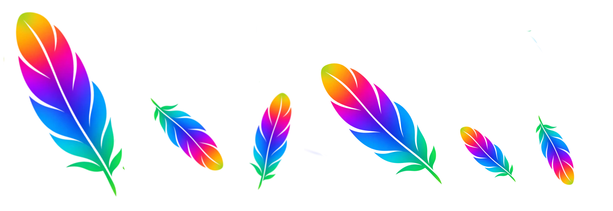
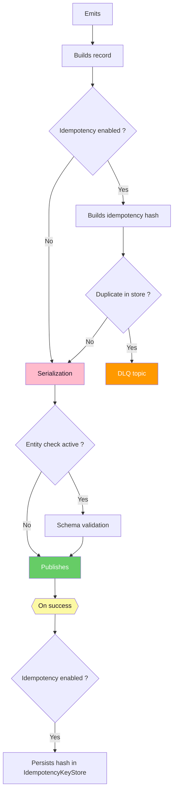
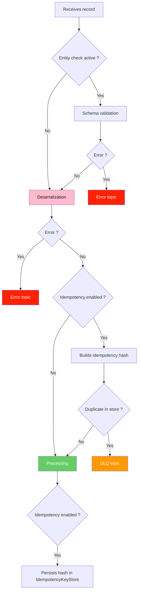

<br>

#  Plume Consumers and Producers

## Summary

- [Overview](#overview-)
    - [Features](#features-)
- [Get Started](#get-started-)
    - [Create a producer](#create-a-producer-)
    - [Create a consumer](#create-a-consumer-)
    - [Enable schema validation](#enable-schema-validation-)
- [Producer Lifecycle](#producer-lifecycle-)
- [Consumer Lifecycle](#consumer-lifecycle-)

<br>

## Overview [🔼](#summary)

- Wrapper library for generic Kafka producers and consumers in java.

- Provides **opinionated handling** for recurring concerns, such as schema validation, duplicates, security.

- Hides boilerplate code and simplifies creation of consumers and producers : Shutdown hooks, processing logic...

#
### Features [🔼](#summary)

- Simplified creation for consumers and producers :

    - **Startup and shutdown hooks** : Built-in support for default and user provided.

    - **Default configuration** :

        - Additional custom configuration can be supplied, but default configuration **cannot be overriden**.

    - **Security** : Simple configuration for different protocols.

    - **Builders** : Mandatory and optional parameters.

- Common `Event` class wraps message payload with *standard metadata*.

- <ins>Optional built-in features</ins> :

    - **Exactly-once processing** : Built-in **idempotency** mechanism to detect and handle duplicates.

    - **Avro schema validation** : Custom serdes.

    - **Error, DLQ and replay** handling.

    - **Client-Side Field Level Encryption** (**CSFLE**) : Support for Hashicorp Vault.

<br>

## Get Started [🔼](#summary)

### Create a producer [🔼](#summary)

``` java
// 1. Create a bootstrap with broker addresses, client id and security config.
ProducerBootstrap producerBootstrap = ProducerBootstrap.with(
        bootstrapServers,
        "client-producer",
        new PlainTextSecurity()
    ).build();

// 2. Create the producer with bootstrap.
EventProducer eventProducer = EventProducer.with(producerBootstrap).build();

// 3. Publish.
eventProducer.publish(TOPIC, "key", event).get();
```
#
### Create a consumer [🔼](#summary)

``` java
// 1. Create a bootstrap with broker addresses, client id, security config, consumer group and topics.
ConsumerBootstrap consumerBootstrap = ConsumerBootstrap.with(
        bootstrapServers,
        "client-consumer",
        new PlainTextSecurity(),
        "eventconsumer-group")
    .forTopic(TOPIC)
    .build();

// 2. Create consumer by providing the processing logic.
EventConsumer eventConsumer = EventConsumer.with(
        consumerBootstrap,
        (_, record) -> processRecord(record)) // User-specific process logic.
    .customProperties(Map.of(ConsumerConfig.AUTO_OFFSET_RESET_CONFIG, "earliest"))
    .build();

// 3. Launch consumer polling thread.
eventConsumer.run();
```
#
### Enable schema validation [🔼](#summary)

``` java
// 1. Specify registry credentials and schema type.
SchemaRegistryConfig schemaRegistryConfig = new SchemaRegistryConfig(
    getSchemaRegistryUrl(),
    "user",
    "pwd",
    SchemaType.AVRO
);

// 2. Specify consumers & producers bootstraps with registry configuration.
ProducerBootstrap producerBootstrap = ProducerBootstrap.with(
        bootstrapServers,
        "client-producer",
        new PlainTextSecurity())
    .withSchemaValidation(schemaRegistryConfig)
    .build();
```
<br>

## Producer Lifecycle [🔼](#summary)


<br>

## Consumer Lifecycle [🔼](#summary)


<br>